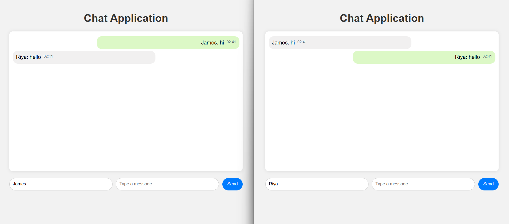

# 🌟 Spring Boot Chat App

[](https://www.oracle.com/java/)
[](https://maven.apache.org/)
[](https://spring.io/projects/spring-boot)

A **real-time chat application** built with **Spring Boot, WebSocket, and Thymeleaf**, enabling multiple users to exchange messages instantly. Designed with a **modern chat UI** including message bubbles, timestamps, and automatic scroll. Ideal for learning **Spring Boot, WebSockets, and full-stack Java development**.

---

## ⚡ Features
- Real-time messaging with **WebSockets & STOMP protocol**
- Messages aligned left/right for **sender and receiver**
- Automatic **scroll to latest message**
- Timestamps on each message
- Unique bubble color for each user
- Smooth **fade-in animations**
- Responsive and clean UI with **Thymeleaf + CSS**

---

## 🛠 Tech Stack
- **Backend:** Spring Boot (Java 21+)  
- **Frontend:** Thymeleaf, HTML, CSS, JS  
- **Real-time Communication:** WebSocket, STOMP, SockJS  
- **Build Tool:** Maven  

---

## 📁 Project Structure
spring-boot-chat-app/
│
├─ src/main/java/com/chat/app/ # Java backend code
│ ├─ controller/ # Chat controllers
│ ├─ model/ # Message models
│ └─ AppApplication.java # Spring Boot main class
│
├─ src/main/resources/
│ ├─ static/ # JS, CSS files
│ └─ templates/ # Thymeleaf HTML pages
│
├─ pom.xml # Maven dependencies
└─ README.md # Project documentation 
---

## 🚀 Setup & Run

1. **Clone the repository**
```bash
git clone https://github.com/PriyanshiGoyal501/spring-boot-chat-app.git
cd spring-boot-chat-app
```
2. **Build the project**
```bash
mvn clean install
```
3. **Run the application**
```bash
mvn spring-boot:run
```
4. **Open in browser**
```bash
 http://localhost:8080
```
## 📸 Screenshots

Here’s a preview of the chat app UI:


